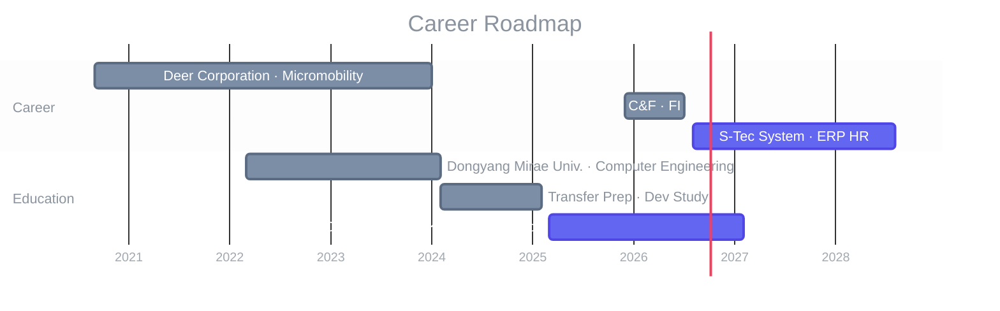

```mermaid
%%{init: {'theme':'base', 'themeVariables': {
  'fontFamily': '-apple-system, Segoe UI, sans-serif',
  'sectionBkgColor': 'rgba(139,148,158,0.08)',
  'altSectionBkgColor': 'rgba(139,148,158,0.02)',
  'gridColor': 'rgba(139,148,158,0.35)',
  'doneTaskBkgColor': '#7C8DA6',
  'doneTaskBorderColor': '#5B6B82',
  'activeTaskBkgColor': '#6366F1',
  'activeTaskBorderColor': '#4F46E5',
  'taskTextColor': '#FFFFFF',
  'taskTextDarkColor': '#FFFFFF',
  'taskTextLightColor': '#FFFFFF',
  'taskTextOutsideColor': '#8B949E',
  'sectionTitleColor': '#8B949E',
  'titleColor': '#8B949E',
  'textColor': '#8B949E',
  'todayLineColor': '#F43F5E'
}}}%%
gantt
    title Career Roadmap
    dateFormat YYYY-MM
    axisFormat %Y
    tickInterval 1year

    section Career
    Deer Corporation · Micromobility  :done,   2020-09, 2024-01
    C&F · FI                          :done,   2025-12, 2026-07
    S-Tec System · ERP HR             :active, 2026-08, 2028-08

    section Education
    Dongyang Mirae Univ. · Computer Engineering :done,   2022-03, 2024-02
    Transfer Prep · Dev Study                   :done,   2024-02, 2025-02
    The Catholic Univ. of Korea · IT Finance    :active, 2025-03, 2027-02
```
