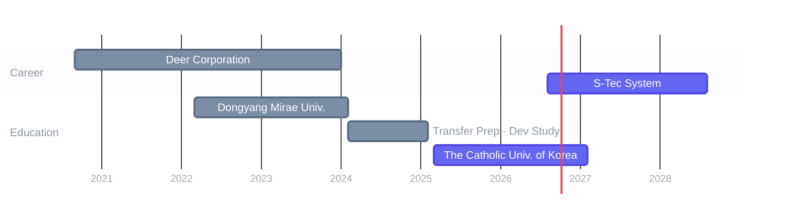

**Timeline**

**Career Details**

- **[S-Tec System](https://www.s-tec.co.kr/intro/intro_01.php) (2026.08 ~ Present)** / Backend Engineer (ERP - HR)
- **[Deer Corporation](https://www.incruit.com/company/1684643644) (2020.09 ~ 2024.01)** / Backend Engineer (Micromobility)

**Open-source**

- **clawd-on-desk** /  [fix: replace wmic with PowerShell Get-CimInstance](https://github.com/rullerzhou-afk/clawd-on-desk/pull/268)
