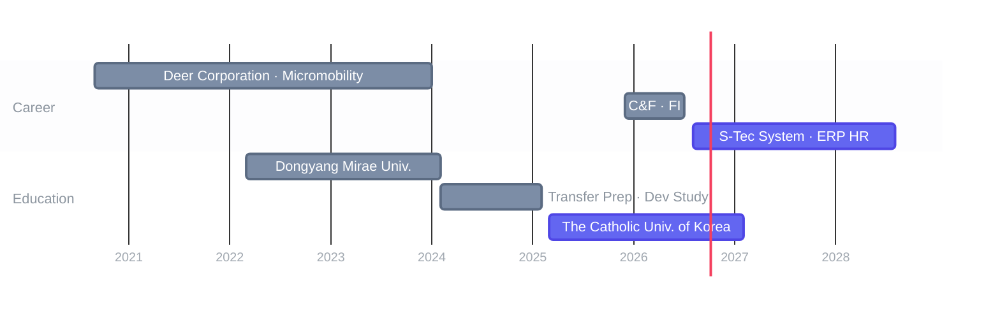

**Main Stacks**

**Timeline**

**Career Details**

- **[S-Tec System](https://www.s-tec.co.kr/intro/intro_01.php) (2026.08 ~ Present)** / Backend Engineer (ERP - HR)
- **C&F System (2025.12 ~ 2026.07)** / Backend Engineer (ERP - FI)
- **Deer Corporation (2020.09 ~ 2024.01)** / Backend Engineer (Micromobility - PG, Geo)

**Open-source**

- **clawd-on-desk** /  [fix: replace wmic with PowerShell Get-CimInstance](https://github.com/rullerzhou-afk/clawd-on-desk/pull/268)
